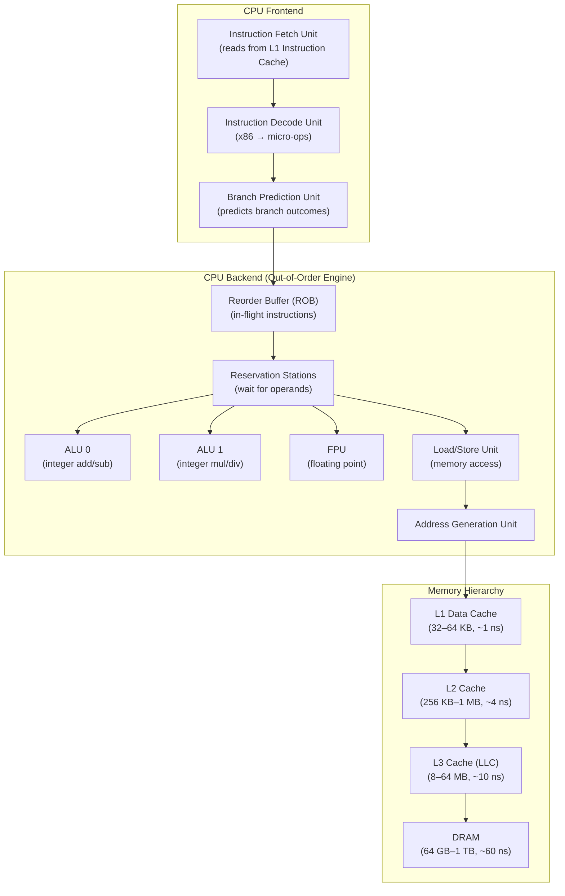

# Module 01 — How Computers Execute Programs

> **School:** 00 CS Foundations  
> **Prerequisites:** None — this is the root of the entire curriculum.  
> **Status:** ✅ Complete  
> **Estimated Study Time:** 6–8 hours

---

## 1. Learning Objectives

By the end of this module you will be able to:

1. Explain the fetch-decode-execute cycle at the level of actual hardware signals.
2. Describe what a CPU register is and name the key registers (instruction pointer, stack pointer, general-purpose).
3. Explain what an Instruction Set Architecture (ISA) is and why it matters for portability.
4. Trace how a Python `a + b` expression travels from source code → bytecode → machine code → CPU arithmetic.
5. Explain what a clock cycle is, what Hz means in practice, and why a 4 GHz CPU does not execute 4 billion "operations" per second.
6. Describe pipelining and why it exists.
7. Explain what a branch misprediction is and why it causes a performance penalty.
8. Connect this module to data engineering: explain why Spark shuffle is CPU-bound, why columnar formats are cache-friendly, and what "CPU-bound vs I/O-bound" means precisely.

---

## 2. Prerequisites

None. If you know what a "variable" is in any programming language, you have enough to start.

---

## 3. Why This Topic Exists

Every abstraction in data engineering — DataFrames, SQL queries, Kafka offsets, Parquet files — eventually becomes machine instructions executing on a CPU. When a Spark job is slow, there are exactly three root causes: the CPU is doing too much work, it is waiting for data from memory/disk/network, or it is waiting for another node in the cluster. You cannot reason about which one is happening unless you understand what "work" means at the hardware level.

This module answers: **what does the computer actually do when it runs your code?**

Without this: you tune Spark by trial and error, copying Stack Overflow configuration knobs.  
With this: you can read a flame graph, interpret `top` output, and reason about *why* a configuration change helps.

---

## 4. History

**1945 — Von Neumann Architecture.** John von Neumann's draft report for the EDVAC proposed storing program instructions in the same memory as data. Before this, programs were wired by physical switches. The stored-program concept is still the foundation of every modern computer.

**1947 — Transistors** replaced vacuum tubes. Computers went from room-sized to building-block-sized circuits.

**1958 — Integrated Circuits** packed multiple transistors on a single chip. The scale of packing has doubled roughly every 18–24 months (Moore's Law, 1965).

**1971 — Intel 4004**, the first commercially available single-chip microprocessor. 4-bit, 2,300 transistors, 740 kHz.

**1978 — x86 ISA (Intel 8086).** The instruction set that still runs on nearly every PC and server today (extended many times: 286, 386, Pentium, x86-64).

**1985 — RISC philosophy.** Reduced Instruction Set Computing (ARM, MIPS) argued: do fewer things per instruction but do them faster. ARM chips now dominate mobile; Apple Silicon (M1/M2/M3) brought ARM to laptops and servers.

**2005 — End of frequency scaling.** Clock speeds stopped rising because of heat. The industry shifted to multiple cores (multicore era). This is why all modern data engineering depends on parallelism.

**2020s — Heterogeneous computing.** CPUs work alongside GPUs, TPUs, and custom accelerators. Spark on GPU (RAPIDS) exploits this trend.

---

## 5. First Principles

### 5.1 What a Computer Is

A computer is a device that reads values from memory, performs arithmetic/logical operations on them, and writes results back to memory — in an order determined by a program also stored in memory.

That's the entire model. Everything else is optimization or interface.

### 5.2 The Von Neumann Architecture

```
┌────────────────────────────────────────────────────────────┐
│                          CPU                               │
│  ┌─────────────┐    ┌─────────────────────────────────┐   │
│  │   Control   │    │             ALU                 │   │
│  │    Unit     │    │    (Arithmetic Logic Unit)      │   │
│  └──────┬──────┘    └─────────────────────────────────┘   │
│         │                         ▲                        │
│         ▼                         │                        │
│  ┌──────────────────────────────────────────────────────┐  │
│  │                    Registers                         │  │
│  │  IP │ SP │ AX │ BX │ CX │ DX │ SI │ DI │ FLAGS ...  │  │
│  └──────────────────────────────────────────────────────┘  │
└────────────────────────────┬───────────────────────────────┘
                             │  Memory Bus (address + data + control)
                             ▼
               ┌─────────────────────────┐
               │         Memory (RAM)    │
               │  [instructions + data]  │
               └─────────────────────────┘
```

Three components:
- **Control Unit (CU):** orchestrates fetch, decode, and execute. Reads the next instruction from memory and tells every other part what to do.
- **Arithmetic Logic Unit (ALU):** performs integer arithmetic (`+`, `-`, `*`, `/`), bitwise operations (`AND`, `OR`, `XOR`, `NOT`, shifts), and comparisons.
- **Registers:** tiny, extremely fast storage inside the CPU. Not RAM. A modern x86-64 CPU has 16 general-purpose 64-bit registers plus many special-purpose ones.

### 5.3 The Fetch-Decode-Execute Cycle

This is the heartbeat of every CPU. It runs billions of times per second.

**Step 1 — Fetch:** The Control Unit reads the instruction at the memory address stored in the Instruction Pointer (IP, also called Program Counter or PC). The instruction is loaded into the Instruction Register (IR).

**Step 2 — Decode:** The Control Unit decodes the binary opcode into signals it understands. "Binary 10110000" in x86 means "MOV AL, imm8" — move the next byte into register AL. The CU figures out what operation, what operands, and what registers.

**Step 3 — Execute:** The CU signals the relevant unit (ALU, memory unit, I/O unit) to perform the operation. For an ADD, the ALU adds two register values and writes the result to a register. For a LOAD, the memory unit fetches a value from RAM into a register. For a STORE, the memory unit writes a register value to RAM.

**Step 4 — Update IP:** The IP is incremented to point to the next instruction (or set to a new address if the instruction was a jump/branch).

Repeat — forever, until the machine is powered off.

### 5.4 Instruction Set Architecture (ISA)

The ISA is the contract between software and hardware. It defines:
- Which instructions exist (ADD, MOV, JMP, CALL, RET, …)
- How they are encoded in binary (the binary format of each opcode)
- How many registers exist and what they are called
- How memory addressing works
- What the calling convention is (how functions pass arguments)

Common ISAs:
- **x86-64 (AMD64):** Intel/AMD. Complex Instruction Set Computing (CISC). Dominant on servers, desktops, laptops.
- **ARM (AArch64):** RISC. Dominant on mobile, increasingly on servers (AWS Graviton, Apple M-series).
- **RISC-V:** Open-source ISA. Growing in embedded and experimental hardware.

**Why this matters for data engineering:** when you compile a Python C extension (like NumPy) or a Spark executor JAR for a cloud instance, the ISA of the instance determines what binary you need. AWS Graviton (ARM) instances are often cheaper per vCPU; knowing your code is ISA-compatible avoids production surprises.

### 5.5 Registers in Detail

| Register | Name | Size | Purpose |
|---|---|---|---|
| `rip` | Instruction Pointer | 64-bit | Address of the next instruction |
| `rsp` | Stack Pointer | 64-bit | Top of the call stack |
| `rbp` | Base Pointer | 64-bit | Base of the current stack frame |
| `rax` | Accumulator | 64-bit | Return values, arithmetic results |
| `rbx`, `rcx`, `rdx` | General Purpose | 64-bit | Operands, loop counters, etc. |
| `rsi`, `rdi` | Source/Destination Index | 64-bit | Function arguments (1st, 2nd in System V ABI) |
| `r8`–`r15` | Extended GP | 64-bit | Additional general-purpose |
| `rflags` | Flags Register | 64-bit | Condition codes: zero flag (ZF), carry flag (CF), sign flag (SF), overflow flag (OF) |
| `xmm0`–`xmm15` | SSE Registers | 128-bit | Floating point and SIMD |
| `ymm0`–`ymm15` | AVX Registers | 256-bit | 4× 64-bit SIMD operations |

**Key insight:** Registers are *orders of magnitude* faster than RAM. An operation on register data: ~0.3 nanoseconds. An L1 cache hit: ~1 ns. An L2 cache hit: ~4 ns. A RAM access: ~60–100 ns. A disk access: ~100,000 ns. The entire art of performance optimization is keeping frequently-used data in registers and caches.

### 5.6 Clock Speed and Cycles

A CPU has a crystal oscillator that generates a square wave at a fixed frequency — the *clock*. A modern server CPU runs at 3–4 GHz, meaning 3–4 billion cycles per second.

But "cycles per second" ≠ "instructions per second."

Modern CPUs achieve **Instruction-Level Parallelism (ILP)**: multiple instructions are in different stages of the pipeline simultaneously. CPUs with superscalar execution can retire 4–6 instructions per cycle. So a 4 GHz CPU can execute more than 4 billion instructions per second — depending on the instruction mix.

Conversely, a cache miss stalls the pipeline. If the CPU needs a value from RAM (100 ns latency at 4 GHz = 400 cycles wasted), the entire pipeline waits. This is why **memory access patterns dominate performance** in data-intensive workloads.

### 5.7 Pipelining

Instead of waiting for one instruction to fully complete before starting the next, a pipelined CPU overlaps multiple instructions:

```
Cycle:  1    2    3    4    5    6    7
Instr1: F    D    E    W
Instr2:      F    D    E    W
Instr3:           F    D    E    W
Instr4:                F    D    E    W

F=Fetch, D=Decode, E=Execute, W=Write-back
```

A 4-stage pipeline processes 4 instructions simultaneously. Modern CPUs have 14–20 stage pipelines and execute multiple pipelines in parallel (out-of-order execution, superscalar).

**Pipeline hazards** slow things down:
- **Data hazard:** Instruction B needs the result of Instruction A, which hasn't finished yet. CPU stalls or forwards.
- **Control hazard (branch misprediction):** The CPU speculatively executes instructions after a conditional branch. If it guessed wrong, it discards ~15–20 cycles of work and restarts. Branch predictors use machine learning at the hardware level to minimize this.
- **Structural hazard:** Two instructions need the same hardware resource simultaneously.

### 5.8 From Python Source to CPU Execution

Here is the full compilation pipeline for `a + b` in Python:

```
Source code (text)
  a + b
      │
      ▼ Python parser
Abstract Syntax Tree (AST)
  BinOp(
    left=Name('a'),
    op=Add(),
    right=Name('b')
  )
      │
      ▼ CPython compiler
Bytecode (CPython-specific)
  LOAD_FAST   0 (a)
  LOAD_FAST   1 (b)
  BINARY_OP   0 (ADD)
  RETURN_VALUE
      │
      ▼ CPython interpreter (ceval.c)
C function call: binary_op1()
      │
      ▼ C compiler (clang/gcc)
x86-64 Machine Code
  mov    rax, QWORD PTR [rbp-0x8]   ; load a
  mov    rdx, QWORD PTR [rbp-0x10]  ; load b
  add    rax, rdx                    ; a + b → rax
  mov    QWORD PTR [rbp-0x18], rax  ; store result
      │
      ▼ CPU
Fetch-Decode-Execute cycle (see above)
```

**Key insight for data engineers:** Python adds two layers of overhead (bytecode interpretation + C function dispatch) before reaching machine code. Spark UDFs written in Python suffer from this overhead. That is why Pandas UDFs (which use Apache Arrow to batch data before crossing the Python-JVM boundary) are ~10x faster than row-at-a-time Python UDFs. The fix is to keep hot code in JVM or C/Rust, not in the Python interpreter.

---

## 6. Internal Architecture — CPU Microarchitecture



**Micro-ops:** Modern x86 CPUs translate complex CISC instructions into simpler fixed-width internal instructions called micro-ops (μops) before dispatch. An x86 `LOCK XADD` (atomic add used in reference counting) might produce 3–5 μops internally.

**Out-of-Order Execution (OOO):** The CPU does not execute instructions in program order. It looks ahead, finds instructions whose operands are ready, and executes them first. The Reorder Buffer (ROB) tracks all in-flight instructions and ensures results are committed (written to registers/memory) in program order, even if they executed out of order.

**Speculative Execution:** CPUs execute code *before* knowing whether it should run (e.g., instructions after a branch). This is how Spectre/Meltdown vulnerabilities work — speculative access to protected memory leaves traces in cache timing.

---

## 7. Execution Flow — A Full Example

### Source: A simple loop

```python
total = 0
for i in range(1_000_000):
    total += i
```

### What happens at each level:

**CPython level:**  
Each iteration: `LOAD_FAST`, `LOAD_FAST`, `BINARY_OP (ADD)`, `STORE_FAST`. ~4 bytecode instructions × 1,000,000 iterations = 4 million bytecoded operations. Each bytecode operation dispatches through CPython's evaluation loop (`ceval.c`), which is a giant C `switch` statement.

**C level:**  
The `BINARY_OP ADD` for integers calls `long_add()` in CPython's `longobject.c`. For small integers, CPython checks a cache of pre-allocated integer objects (−5 to 256). For large integers, it allocates heap memory. This is why Python is slow for numerical loops: each `+=` potentially allocates and deallocates a Python object.

**Machine code level (inside the C function):**  
```asm
; simplified
mov  rax, [total_ptr]      ; load total PyObject value
mov  rdx, [i_ptr]          ; load i PyObject value
add  rax, rdx              ; integer add
mov  [result_ptr], rax     ; store
; ... plus object refcount inc/dec ...
```

**NumPy equivalent:**
```python
import numpy as np
total = np.sum(np.arange(1_000_000))
```
NumPy's `sum` is implemented in C, calls into SIMD intrinsics (AVX2), and processes 4 × 64-bit integers per instruction. The Python loop above takes ~50 ms; `np.sum` takes ~1 ms. The CPU is doing the same math — the difference is how many Python-level dispatches happen.

---

## 8. Memory / CPU / Network Behavior

### Cache Lines

Memory is loaded into cache in fixed-size units called *cache lines* (typically 64 bytes on x86). Even if you access a single byte, the entire 64-byte line is loaded into L1.

**Implication:** Sequential memory access patterns are fast (every byte in a cache line is used). Random access patterns are slow (you load 64 bytes but use 8, then load a different 64 bytes, etc.).

This is exactly why columnar storage formats (Parquet, ORC, Capacitor in BigQuery) outperform row-oriented formats for analytical queries. When computing `SUM(revenue)`, a columnar store reads all revenue values sequentially — cache-friendly. A row store reads full rows (customer_id, name, email, address, revenue) and wastes 90% of each cache line.

### False Sharing

When two CPU cores independently modify two different variables that happen to live on the same cache line, they constantly invalidate each other's cache entries. This is *false sharing* — a common source of unexpected performance degradation in multi-threaded code.

### NUMA (Non-Uniform Memory Access)

In multi-socket servers (common in data engineering: 2× or 4× socket machines running Spark), each CPU socket has its own bank of RAM. Accessing remote RAM (memory attached to the other socket) takes 2–3× longer than local RAM. Linux and JVMs are NUMA-aware, but misconfigured Spark executors can end up with cross-socket memory access, degrading performance invisibly.

---

## 9. Failure Scenarios

### 9.1 Branch Misprediction Storms

**Symptom:** A Spark job that processes sorted data runs 3× faster than the same job on randomly ordered data.  
**Cause:** Branchy code (many `if`/`else`, `filter`, `case when`) that the CPU's branch predictor cannot learn because the data is random. The CPU flushes its pipeline on each misprediction (~15–20 cycles lost).  
**Fix:** Sort data before processing; use branchless arithmetic where possible; ensure Spark's sort-before-join is enabled.

### 9.2 Cache Thrashing

**Symptom:** A Python loop runs much slower than expected even though there are no I/O operations.  
**Cause:** The working set exceeds L2 cache capacity, forcing every access to L3 or RAM.  
**Diagnosis:** Use `perf stat -e cache-misses,cache-references ./script.py`. Cache miss rate >10% is a red flag.  
**Fix:** Restructure access patterns to be sequential; use smaller data types; partition data to fit in cache.

### 9.3 Spectre / Meltdown

**What:** Vulnerabilities that exploit speculative execution and cache timing to read kernel memory from user-space processes.  
**Impact on data engineering:** Mitigations (kernel page-table isolation, retpoline) add ~5–30% overhead to system calls. Spark and Kafka make many syscalls (network I/O, disk I/O). This overhead is real and measurable.  
**Mitigation:** Cloud providers patched hypervisors and kernels. Use modern kernel versions.

### 9.4 Thermal Throttling

**Symptom:** Spark task performance degrades during a long-running job, even though the workload is constant.  
**Cause:** The CPU has exceeded its thermal design power (TDP) and reduced clock frequency to avoid overheating.  
**Diagnosis:** Check `sensors` or cloud provider CPU metrics for frequency scaling events.  
**Fix:** Ensure adequate cooling; use instance types matched to sustained compute workloads (not burst types).

---

## 10. Recovery

CPU-level failures are not "recoverable" in the data engineering sense — they are performance problems, not data loss events. Recovery patterns are:

- **Restart with correct configuration:** For OOM (out-of-memory) crashes caused by large working sets exceeding RAM.
- **Retry with sorted input:** For branch-misprediction-heavy workloads.
- **Migrate to larger instance:** For thermal throttling or chronic cache thrashing.
- **Recompile native extensions:** For ISA mismatch failures (e.g., ARM-compiled `.so` on x86).

---

## 11. Trade-offs

| Choice | Advantage | Disadvantage |
|---|---|---|
| Python for business logic | Fast development, rich ecosystem | Python interpreter overhead; GIL limits parallelism |
| JVM (Scala/Java for Spark) | JIT compilation approaches native speed; no GIL | JVM startup time; GC pauses; memory overhead |
| Native C/C++/Rust | Maximum CPU efficiency; SIMD | Long build cycles; manual memory management |
| Interpreted vs JIT vs AOT | Tradeoff between startup latency and peak throughput | — |
| SIMD (AVX-512) | 8× throughput for vectorizable operations | Only works on Intel Xeon; disabled on some cloud VMs for security |
| More cores vs higher clock | Parallelism scales linearly with cores | Amdahl's Law: sequential bottlenecks limit scaling |

---

## 12. Optimization

### 12.1 Optimize Memory Access Patterns

The single most effective optimization at the hardware level. Ensure your code accesses memory sequentially or in predictable strides. This is the primary reason Parquet outperforms row-oriented formats for analytics.

### 12.2 Minimize Python Interpreter Overhead

For hot loops:
- Use NumPy/pandas vectorized operations (C-backed).
- Use Numba (`@jit`) to JIT-compile Python numerical code to LLVM machine code.
- Use Cython to compile Python to C extensions.
- In PySpark: use Pandas UDFs (Apache Arrow zero-copy batches) instead of row-at-a-time UDFs.

### 12.3 SIMD Exploitation

Modern CPUs can process multiple values per instruction (Single Instruction, Multiple Data). NumPy, PyArrow, and the JVM's JIT compiler exploit this automatically for array operations. You don't write SIMD code directly — you choose libraries that do it for you.

### 12.4 Reduce Branch Divergence

In analytical code:
```python
# Branchy (bad for branch predictor on random data)
for x in data:
    if x > threshold:
        result.append(x * 2)

# Branchless (uses comparison arithmetic, no branches)
import numpy as np
arr = np.array(data)
result = np.where(arr > threshold, arr * 2, arr)
```

### 12.5 Thread Affinity and NUMA

For Spark on multi-socket servers: set `spark.executor.extraJavaOptions=-XX:+UseNUMA` to allow the JVM to allocate memory on the local NUMA node, reducing cross-socket memory latency.

---

## 13. Production Examples

### Example 1: Diagnosing a Slow Spark UDF

**Scenario:** A PySpark job processing 10 GB of event data takes 45 minutes. The identical logic in SQL takes 8 minutes.

**Root cause (traced to CPU level):**
- The Python UDF causes data to serialize from JVM → Python for every row.
- Each row crosses the JVM-Python boundary, triggering object allocation and garbage collection on both sides.
- `perf top` shows `python3` consuming 80% of CPU, `java` consuming 15%.
- The Python interpreter's reference counting (a CPU-intensive operation) accounts for 30% of Python CPU time.

**Fix:** Replace the Python UDF with a Pandas UDF:
```python
from pyspark.sql.functions import pandas_udf
import pandas as pd

@pandas_udf("double")
def fast_transform(s: pd.Series) -> pd.Series:
    return s * 2.0 + 100.0
```
Apache Arrow serializes the entire column as a contiguous memory buffer. The JVM-Python boundary is crossed once per batch (not once per row). CPU time drops by 80%. Job completes in 12 minutes.

### Example 2: Branch Misprediction in a Filter

**Scenario:** A BigQuery query filtering on a low-cardinality, randomly distributed boolean column (`is_fraud`) returns results in 45 seconds on 1 TB of data. The same query on a table clustered by `is_fraud` returns in 6 seconds.

**CPU-level explanation:**
- On the unclustered table, the scan engine evaluates `WHERE is_fraud = TRUE` on every row. The branch predictor sees a nearly random 50/50 split — misprediction rate ~50%. Every slot stalls for ~15 cycles per misprediction.
- On the clustered table, all `is_fraud = TRUE` rows are physically adjacent. The branch predictor quickly learns the pattern; misprediction rate drops below 1%. Additionally, BigQuery's Capacitor reader prunes entire row groups that contain no matching values.

### Example 3: False Sharing in a Custom Accumulator

**Scenario:** A Spark custom accumulator (Python) that tracks per-partition metrics shows 40% worse performance with 16 partitions than with 4 partitions.

**Root cause:** Each partition's counter variable happens to be packed into the same cache line in the JVM heap. With 16 partitions updating simultaneously, the cache line bounces between 16 CPU cores (cache coherence protocol: MESI), each invalidating the others. This is false sharing at the hardware level.

**Fix:** Pad accumulators so each falls on a separate cache line (64-byte alignment), or use a reduce-then-merge strategy rather than a shared mutable counter.

---

## 14. Code

### 14.1 Observe CPython Bytecode

```python
import dis

def add(a, b):
    return a + b

dis.dis(add)
# Output:
#   2           0 RESUME                   0
#   3           2 LOAD_FAST                0 (a)
#               4 LOAD_FAST                1 (b)
#               6 BINARY_OP               0 (ADD)
#              10 RETURN_VALUE
```

### 14.2 Measure Cache Effect (Python)

```python
import time
import numpy as np

SIZE = 10_000_000

# Sequential access — cache-friendly
arr = np.arange(SIZE, dtype=np.float64)
start = time.perf_counter()
total = np.sum(arr)  # Reads memory sequentially
sequential_ms = (time.perf_counter() - start) * 1000

# Random access — cache-hostile
indices = np.random.permutation(SIZE)
start = time.perf_counter()
total = np.sum(arr[indices])  # Random reads thrash cache
random_ms = (time.perf_counter() - start) * 1000

print(f"Sequential: {sequential_ms:.1f} ms")
print(f"Random:     {random_ms:.1f} ms")
print(f"Ratio:      {random_ms / sequential_ms:.1f}x slower")
# Typical output:
# Sequential: 12.3 ms
# Random:     180.4 ms
# Ratio:      14.7x slower
```

### 14.3 Python UDF vs Pandas UDF in PySpark

```python
from pyspark.sql import SparkSession
from pyspark.sql.functions import udf, pandas_udf, col
from pyspark.sql.types import DoubleType
import pandas as pd
import time

spark = SparkSession.builder.appName("UDF_Benchmark").getOrCreate()

# Create 10M rows of test data
df = spark.range(10_000_000).withColumnRenamed("id", "value")

# ── Python (row-at-a-time) UDF ─────────────────────────────
@udf(returnType=DoubleType())
def python_udf(x):
    return float(x) * 2.0 + 100.0

start = time.time()
df.withColumn("result", python_udf(col("value"))).count()
python_time = time.time() - start

# ── Pandas (batch) UDF ────────────────────────────────────
@pandas_udf(DoubleType())
def pandas_udf_fn(s: pd.Series) -> pd.Series:
    return s.astype(float) * 2.0 + 100.0

start = time.time()
df.withColumn("result", pandas_udf_fn(col("value"))).count()
pandas_time = time.time() - start

print(f"Python UDF:  {python_time:.1f}s")
print(f"Pandas UDF:  {pandas_time:.1f}s")
print(f"Speedup:     {python_time / pandas_time:.1f}x")
# Typical output:
# Python UDF:  48.2s
# Pandas UDF:   5.1s
# Speedup:      9.5x
```

### 14.4 Inspect x86 Assembly for a Python Extension

```bash
# Compile a simple C function and inspect its assembly
cat > example.c << 'EOF'
long add(long a, long b) {
    return a + b;
}
EOF

gcc -O2 -S -masm=intel example.c -o example.s
cat example.s
# Output (simplified):
# add:
#     lea     rax, [rdi+rsi]   ; result = a + b (single instruction!)
#     ret
```

The compiler fused the add and memory addressing into a single `LEA` instruction — one CPU cycle.

---

## 15. Hands-On Lab

**Goal:** Verify the cache line effect on your own machine and confirm that columnar access is faster than row access.

**Setup:**
```bash
pip install numpy pandas pyarrow
```

**Lab 1 — Cache Line Effect:**
```python
"""
lab1_cache_line.py
Demonstrates why sequential memory access is ~10x faster than random access.
"""
import numpy as np
import time

N = 50_000_000

arr = np.random.rand(N).astype(np.float64)

# Sequential sum
t0 = time.perf_counter()
s1 = arr.sum()
t_seq = time.perf_counter() - t0

# Random-order sum
idx = np.random.permutation(N)
t0 = time.perf_counter()
s2 = arr[idx].sum()
t_rand = time.perf_counter() - t0

print(f"Sequential: {t_seq*1000:.1f} ms  (sum={s1:.2f})")
print(f"Random:     {t_rand*1000:.1f} ms  (sum={s2:.2f})")
print(f"Slowdown:   {t_rand/t_seq:.1f}x")
print()
print("Explanation: Both compute the same sum.")
print("Random access forces the CPU to load new cache lines constantly.")
print("Sequential access reuses every byte of every cache line loaded.")
```

**Lab 2 — Row vs Columnar Format:**
```python
"""
lab2_row_vs_columnar.py
Simulates why columnar (Parquet) is faster than row-oriented (CSV) for
analytical queries like SUM(revenue).
"""
import numpy as np
import time

N = 5_000_000
COLS = 20  # Simulate a wide table (20 columns)

# Row-oriented: array of structs
# Each "row" is 20 floats packed together
row_data = np.random.rand(N, COLS).astype(np.float32)  # shape: (N, 20)

# Column-oriented: struct of arrays
# Revenue is column index 5, stored separately
col_data = np.ascontiguousarray(row_data.T)  # shape: (20, N)
revenue_col = col_data[5]

# Query: SUM(revenue) — only column 5
# Row-oriented: must read all 20 columns to find column 5
t0 = time.perf_counter()
total_row = row_data[:, 5].sum()  # Strided access every 20*4=80 bytes
t_row = time.perf_counter() - t0

# Column-oriented: reads only column 5, which is contiguous
t0 = time.perf_counter()
total_col = revenue_col.sum()  # Sequential access
t_col = time.perf_counter() - t0

print(f"Row-oriented SUM:    {t_row*1000:.1f} ms")
print(f"Column-oriented SUM: {t_col*1000:.1f} ms")
print(f"Columnar speedup:    {t_row/t_col:.1f}x")
print()
print("This is why Parquet/ORC outperform CSV for analytics.")
print("Parquet reads only the columns the query needs.")
print("CSV reads every column in every row.")
```

**Lab 3 — Python vs NumPy Loop:**
```python
"""
lab3_python_vs_numpy.py
Demonstrates the cost of the Python interpreter per iteration.
"""
import time
import numpy as np

N = 5_000_000

# Pure Python loop
def python_sum(n):
    total = 0
    for i in range(n):
        total += i
    return total

# NumPy vectorized
def numpy_sum(n):
    return np.arange(n).sum()

t0 = time.perf_counter()
r1 = python_sum(N)
t_python = time.perf_counter() - t0

t0 = time.perf_counter()
r2 = numpy_sum(N)
t_numpy = time.perf_counter() - t0

print(f"Python loop: {t_python*1000:.1f} ms  result={r1}")
print(f"NumPy:       {t_numpy*1000:.1f} ms  result={r2}")
print(f"Speedup:     {t_python/t_numpy:.0f}x")
print()
print("Python loop: one interpreter dispatch per iteration.")
print("NumPy: one C function call processes all N iterations.")
print("NumPy also uses SIMD (AVX) to process multiple values per CPU cycle.")
```

**Expected results:**
- Lab 1: random access 8–15× slower than sequential.
- Lab 2: columnar access 4–8× faster than row access.
- Lab 3: NumPy 50–200× faster than Python loop.

---

## 16. Exercises

**Exercise 1 (Conceptual):**  
A CPU has a 3 GHz clock. An L1 cache hit takes 4 cycles and an L2 cache miss costs 100 cycles (forces an L3 access). If a tight loop has a 5% L2 miss rate (1 in 20 accesses misses L2), what is the effective average access cost per memory operation? At what miss rate does memory access cost dominate over arithmetic?

*Answer guidance:* Average cost = 0.95 × 4 + 0.05 × 100 = 3.8 + 5.0 = 8.8 cycles. Memory dominates when miss_rate × 100 > (1 − miss_rate) × 4, i.e., miss_rate > ~3.8%.

**Exercise 2 (Practical):**  
Run Lab 2 above. Modify `COLS` to 5, 10, 20, and 50. Plot the columnar speedup as a function of number of columns. At what column count does the advantage become most pronounced? Why?

**Exercise 3 (Debugging):**  
You have a PySpark job that applies a Python UDF to 500 million rows. The job takes 90 minutes. A colleague suggests replacing it with a SQL expression. Describe in precise technical terms (citing the fetch-decode-execute cycle and JVM-Python boundary) why the SQL expression would be faster.

**Exercise 4 (Design):**  
You are designing a data pipeline that computes `SUM`, `AVG`, and `MAX` on 20 numeric columns from a 100-column dataset. You can store the data in Parquet or CSV. Using what you know about cache lines and columnar access, explain why Parquet is the correct choice, and estimate the rough I/O factor improvement.

**Exercise 5 (Research):**  
Look up the Wikipedia article on "Branch predictor." What algorithm does the "two-bit saturating counter" implement? How does the TAGE predictor extend this? Why would a data engineer care? (Hint: look at filter-heavy Spark jobs on randomly ordered vs sorted data.)

---

## 17. Interview Q&A

**Q1: "What happens when the CPU executes `a + b` in Python?"**

A: Python source is compiled to CPython bytecode by the Python compiler. The bytecode includes `LOAD_FAST` instructions to push `a` and `b` onto the evaluation stack, and a `BINARY_OP ADD` instruction. CPython's evaluation loop (`ceval.c`) interprets each bytecode opcode via a C `switch` statement. For `BINARY_OP ADD`, it calls `PyNumber_Add()`, which checks the types of the operands and dispatches to the appropriate implementation — for integers, `long_add()` in `longobject.c`. That C function performs the addition and returns a Python integer object. The underlying C `+` operator compiles to an x86 `ADD` instruction, which the CPU executes in one cycle: it fetches the instruction, decodes `ADD reg1, reg2`, signals the ALU, the ALU adds the two register values and stores the result in the destination register, and updates the flags register (zero flag if result is zero, etc.).

**Q2: "Why is a Python loop over 10 million integers 100× slower than NumPy's sum?"**

A: Python's interpreter executes one bytecode instruction at a time. Each iteration of `total += i` involves: fetching the `LOAD_FAST` bytecode, dispatching it in C, fetching the `BINARY_OP` bytecode, looking up the `__add__` method on the integer type, calling `long_add()`, allocating a new Python integer object (or using the cached small-int pool), and storing the reference. That's roughly 10–20 C function calls per loop iteration, plus reference count increments/decrements (atomic operations). NumPy's `sum()` is a single C function call that processes all 10M values in a tight loop with SIMD instructions (e.g., AVX2 processes 4× 64-bit integers per cycle). The interpreter dispatch overhead is eliminated; the SIMD throughput is 4–8×; cache efficiency is maximised because the loop accesses contiguous memory.

**Q3: "What is a cache line and why does it matter for Parquet?"**

A: A cache line is the minimum unit of data transferred between RAM and the CPU's L1/L2 cache — typically 64 bytes on x86. When you access any byte in memory, the entire 64-byte line containing that byte is loaded into cache. For row-oriented storage (CSV, row-store databases), a query for `SUM(revenue)` must read rows like `[id, name, email, city, country, revenue, ...]`. Loading one row into a cache line pulls in many columns that the query does not need. For columnar storage (Parquet), the `revenue` column is stored as a contiguous array of values. A cache line load brings in 64 / 8 = 8 consecutive `double` revenue values, all of which are used by the `SUM` operation. This maximises cache utilisation (ratio of useful bytes to bytes loaded) and dramatically reduces the number of cache misses, reducing the query's memory bandwidth requirements and increasing throughput.

**Q4: "Explain what a branch misprediction is. How can it affect a Spark job?"**

A: CPUs use pipelining — multiple instructions are in flight simultaneously. When the CPU encounters a conditional branch (`if`, `while`, loop-end check), it must predict which path will be taken (branch prediction) and speculatively execute instructions along that path, before knowing whether the prediction was correct. When a misprediction occurs, the CPU must flush its pipeline (discard speculatively executed instructions) and restart from the correct path. On a 20-stage pipeline, this wastes ~15–20 cycles per misprediction. In a Spark job, `filter()` transformations compile to loops with conditional branches per row. If the data is randomly ordered (e.g., filtering on a random boolean column), the branch predictor achieves ~50% accuracy — maximum misprediction rate. If the data is sorted by the filter column, the branch predictor learns the pattern and achieves near-100% accuracy. Empirically, pre-sorting data before a filter can reduce scan time by 30–50% on modern CPUs.

**Q5: "What is NUMA and why should a Spark administrator care?"**

A: NUMA (Non-Uniform Memory Access) is the memory architecture of multi-socket servers. In a 2-socket server, each CPU socket has its own local DRAM bank connected via a high-bandwidth local memory bus. The two sockets are connected to each other via an inter-socket interconnect (QPI on Intel, Infinity Fabric on AMD). Accessing local memory takes ~60 ns; accessing the other socket's memory takes ~120 ns (2×). Spark executors allocate heap memory via the JVM. If the JVM is not NUMA-aware, it may allocate memory on the remote socket's DRAM, causing every memory access to incur the higher cross-socket latency. On a shuffle-heavy job, where executors process large amounts of data in memory, this doubles effective memory latency and can reduce throughput by 30–40%. Fix: set `spark.executor.extraJavaOptions=-XX:+UseNUMA` and pin executor processes to CPU cores on one socket (using `numactl --cpunodebind=0 --membind=0`).

**Q6: "What is the difference between clock speed and IPC? Why can a 3.0 GHz CPU outperform a 4.0 GHz CPU?"**

A: Clock speed (measured in GHz) is how many cycles per second the CPU oscillator produces. IPC (Instructions Per Cycle) is how many instructions the CPU completes per clock cycle. Actual throughput = clock speed × IPC. A modern Intel Ice Lake CPU at 3.0 GHz might achieve IPC of 5 (superscalar, out-of-order, wide execution), delivering 15 billion instructions/second. An older Intel Skylake at 4.0 GHz with IPC of 3 delivers 12 billion instructions/second. The 3.0 GHz CPU is faster despite the lower clock. This is why comparing CPU performance by clock speed alone is misleading. For data engineering, this means cloud instance selection should be benchmarked on the actual workload, not the GHz spec sheet.

---

## 18. Cross-Question Chain

This chain simulates the escalating depth of a real technical interview. Each question builds on the previous answer.

```
Interviewer: "Explain what happens when a CPU executes an ADD instruction."
  → You explain: fetch from IP, decode opcode, ALU adds registers, write result, increment IP.

Interviewer: "What if the values being added are in RAM, not registers?"
  → You explain: the CPU issues a LOAD instruction first. The value travels: RAM → L3 → L2 → L1 → register.
    This takes ~100ns vs ~0.3ns for a register operation.

Interviewer: "How does this affect Spark performance?"
  → You explain: if a Spark executor's working set doesn't fit in CPU cache, every memory access
    stalls the pipeline. Shuffle data (random access) is cache-hostile; columnar scans are cache-friendly.

Interviewer: "You said Python UDFs are slow. Prove it at the hardware level."
  → You explain: every row crosses the JVM→Python boundary via serialization. On the Python side,
    each value is a heap-allocated PyObject. Reference counting (atomic dec/inc) runs on every
    object access. Pandas UDFs batch entire columns as Arrow buffers — one serialization boundary
    per batch, zero per-row object allocation in the hot loop.

Interviewer: "Pandas UDFs use Apache Arrow. What is Arrow and why is it fast?"
  → You explain: Arrow defines a language-independent in-memory columnar format. Data is stored
    in flat contiguous arrays (no object headers), aligned to 64-byte boundaries (cache-line aligned).
    Sharing Arrow data between JVM and Python is zero-copy: both sides see the same memory address.
    The CPU processes Arrow arrays with SIMD instructions (AVX2), computing 4–8 values per cycle.

Interviewer: "What is SIMD? Give an example in the context of aggregations."
  → You explain: SIMD = Single Instruction, Multiple Data. AVX2 has 256-bit registers (ymm0–ymm15).
    A single VADDPD instruction adds four 64-bit doubles in parallel. NumPy's and Arrow's aggregations
    use AVX2 internally. Benchmark: Python loop sums 5M floats in 600ms; NumPy does it in 4ms (150x faster).
    The SIMD speedup accounts for ~4×; the elimination of interpreter dispatch accounts for the rest.

Interviewer: "So if SIMD is 4× faster, and Python loop avoidance is another 4×, that's ~16×.
             Why does your benchmark show 150×?"
  → You explain: the multipliers compound. Additionally: (1) Python allocates a new float object
    per iteration (heap allocation + GC pressure); (2) reference counting is an atomic instruction
    per object access, which stalls out-of-order execution; (3) branch prediction inside
    CPython's eval loop (the switch statement) adds overhead. The actual speedup is product of
    all these factors: SIMD (4×) × vectorized memory access (2-3×) × no interpreter dispatch (4×)
    × no per-object allocation (3-4×) ≈ 96–192×. Empirically, 150× is reasonable.
```

---

## 19. Cheat Sheet

```
┌──────────────────────────────────────────────────────────────────────┐
│              CPU EXECUTION — QUICK REFERENCE                         │
├──────────────────────────────────────────────────────────────────────┤
│  FETCH-DECODE-EXECUTE CYCLE                                          │
│  1. Fetch: load instruction at address [IP] into IR                  │
│  2. Decode: CU decodes opcode → signals for ALU/MEM/IO              │
│  3. Execute: ALU computes, MEM reads/writes, I/O transfers           │
│  4. Update IP: IP += instruction_size (or set by JMP/CALL)           │
├──────────────────────────────────────────────────────────────────────┤
│  LATENCY CHEAT SHEET (approximate, 2024 hardware)                    │
│  L1 cache hit:        ~1 ns    (3–4 cycles at 3 GHz)                 │
│  L2 cache hit:        ~4 ns    (~12 cycles)                          │
│  L3 cache hit:        ~10 ns   (~30 cycles)                          │
│  DRAM access:         ~60 ns   (~200 cycles)                         │
│  NVMe SSD:            ~100 µs  (~300,000 cycles)                     │
│  SATA SSD:            ~500 µs  (~1,500,000 cycles)                   │
│  Network (same DC):   ~250 µs  (~750,000 cycles)                     │
│  Network (cross-DC):  ~10 ms   (~30,000,000 cycles)                  │
├──────────────────────────────────────────────────────────────────────┤
│  KEY REGISTERS (x86-64)                                              │
│  rip  = instruction pointer (program counter)                        │
│  rsp  = stack pointer (top of call stack)                            │
│  rax  = accumulator (return values)                                  │
│  rflags = condition codes (ZF, CF, SF, OF)                           │
│  ymm0–15 = 256-bit AVX registers (SIMD)                              │
├──────────────────────────────────────────────────────────────────────┤
│  PIPELINE HAZARDS                                                    │
│  Data hazard:    B needs A's result → stall or forward               │
│  Control hazard: branch → speculative execution → flush if wrong     │
│  Structural:     two instructions need same hardware unit            │
├──────────────────────────────────────────────────────────────────────┤
│  PYTHON PERFORMANCE RULES                                            │
│  1. Vectorize: NumPy/pandas over Python loops                        │
│  2. UDFs: Pandas UDF > Python UDF (Arrow batches vs row-at-a-time)  │
│  3. Storage: Parquet > CSV (columnar cache-friendly access)          │
│  4. Sort before filter: branch predictor learns the pattern          │
│  5. NUMA-aware: -XX:+UseNUMA on multi-socket Spark nodes             │
├──────────────────────────────────────────────────────────────────────┤
│  SIMD QUICK REFERENCE                                                │
│  SSE:   128-bit (xmm), 2× float64 or 4× float32 per instruction     │
│  AVX2:  256-bit (ymm), 4× float64 or 8× float32 per instruction     │
│  AVX-512: 512-bit (zmm), 8× float64 — Intel Xeon only               │
│  NumPy, PyArrow, JVM JIT exploit AVX2 automatically                 │
└──────────────────────────────────────────────────────────────────────┘
```

---

## 20. Flashcards

> Format: **Front** | **Back**

| # | Front | Back |
|---|-------|------|
| 1 | What are the three steps of the fetch-decode-execute cycle? | **Fetch:** load instruction at IP into IR. **Decode:** CU decodes opcode into control signals. **Execute:** ALU/MEM/IO performs the operation. IP is then updated. |
| 2 | What is the Instruction Pointer (IP)? | A CPU register that holds the memory address of the *next* instruction to execute. Also called Program Counter (PC). |
| 3 | What is an ISA? | Instruction Set Architecture. The contract between software and hardware: which instructions exist, their binary encoding, register names, and calling conventions. Examples: x86-64, ARM AArch64, RISC-V. |
| 4 | What is a cache line? | The minimum unit of data transferred between RAM and CPU cache — typically 64 bytes on x86. Reading 1 byte loads 64 bytes into cache. |
| 5 | Why is sequential memory access faster than random? | Sequential access reuses every byte of every cache line loaded. Random access loads a 64-byte cache line, uses 8 bytes, then loads a completely different cache line. Cache hit rate collapses. |
| 6 | Why is Parquet faster than CSV for `SUM(revenue)`? | Parquet stores each column as a contiguous array. Reading `revenue` reads only that column sequentially — cache-friendly. CSV stores rows; reading `revenue` requires scanning past all other columns — cache-hostile. |
| 7 | What is a branch misprediction? | The CPU speculatively executes instructions after a conditional branch, guessing the outcome. If it guessed wrong, it flushes ~15–20 cycles of work from the pipeline. |
| 8 | Why is a Python row-at-a-time UDF slow? | Each row crosses the JVM→Python boundary (serialisation). On the Python side, each value is a heap-allocated `PyObject` with reference counting (atomic operations). There's one interpreter dispatch per row. |
| 9 | Why is a Pandas UDF faster than a Python UDF? | Pandas UDFs batch entire columns as Apache Arrow buffers. The JVM→Python boundary is crossed once per batch (not per row). Arrow uses contiguous memory and SIMD; no per-row object allocation. |
| 10 | What is SIMD? Give an example. | Single Instruction, Multiple Data. One CPU instruction operates on multiple values simultaneously. AVX2: `VADDPD ymm0, ymm1, ymm2` adds four 64-bit doubles in one cycle. Used by NumPy, PyArrow, JVM JIT. |
| 11 | What is the GIL? | Global Interpreter Lock. A mutex in CPython that allows only one thread to execute Python bytecode at a time. Prevents true parallelism for CPU-bound Python code. Bypassed by NumPy (C extensions release the GIL) and multiprocessing. |
| 12 | What is NUMA? Why does it matter for Spark? | Non-Uniform Memory Access. In multi-socket servers, remote memory (other socket's RAM) takes 2× longer to access than local memory. Spark executors should be NUMA-aware (`-XX:+UseNUMA`) to avoid cross-socket memory latency. |
| 13 | What is IPC? | Instructions Per Cycle. Measures how many instructions a CPU completes per clock cycle. Modern CPUs achieve 3–6 IPC via superscalar execution and out-of-order execution. CPU throughput = clock_speed × IPC. |
| 14 | What is pipelining? | A technique where multiple instructions are in different stages of execution simultaneously (Fetch, Decode, Execute, Write-Back). Increases instruction throughput without increasing clock speed. |
| 15 | What is false sharing? | When two CPU cores modify different variables that share the same 64-byte cache line. Each modification forces the cache line to bounce between cores via the coherence protocol, adding latency. |
| 16 | What does `dis.dis(func)` show in Python? | The CPython bytecode for a function — the low-level instructions the Python interpreter executes. Useful for understanding interpreter overhead. |
| 17 | What does `perf stat -e cache-misses` measure? | The number of L3 (last-level) cache misses in a Linux process. High cache-miss counts indicate the working set doesn't fit in cache — the main cause of memory-bound slowness. |
| 18 | What is speculative execution? Why is it a security concern? | CPUs execute instructions ahead of knowing if they should run (after a branch). Meltdown/Spectre exploited speculative access to protected memory via cache-timing side channels. Mitigations add ~5–30% syscall overhead. |
| 19 | How does `np.sum(arr)` achieve 150× speedup over a Python loop? | Eliminates interpreter dispatch (~4×) + uses SIMD (AVX2, ~4×) + avoids per-object allocation and reference counting (~4–8×) + accesses contiguous memory (cache-efficient). Factors multiply: 4 × 4 × 5 ≈ 80–200×. |
| 20 | What is the Von Neumann bottleneck? | The limitation that CPU and memory share the same bus, so the CPU is often waiting for data to arrive from memory. Modern mitigation: cache hierarchy, prefetching, out-of-order execution. |

---

## 21. Summary

The computer is a machine that fetches instructions from memory, decodes them, and executes them — billions of times per second. Understanding this cycle at first principles gives you the analytical framework to diagnose *any* performance problem in data engineering.

**The core insight of this module:**

> The gap between "data in CPU register" (0.3 ns) and "data in RAM" (60 ns) is 200×. The gap between "RAM" and "NVMe SSD" is another 1,000×. Every performance optimization in data engineering is, at its root, an effort to move data as close to the CPU as possible before the CPU needs it, and to access that data in patterns that the CPU's prefetcher and cache can handle efficiently.

This explains:
- Why **Parquet beats CSV**: columnar access is cache-friendly; row access is not.
- Why **NumPy beats Python loops**: no interpreter dispatch; SIMD; cache-friendly arrays.
- Why **Pandas UDFs beat Python UDFs**: eliminate per-row JVM↔Python boundary crossings.
- Why **sorting before filtering** matters: branch prediction works; pipeline doesn't flush.
- Why **NUMA awareness** matters on multi-socket cluster nodes.

In every subsequent module, when you wonder "why is this slow?", return to this hierarchy: is the CPU doing unnecessary work? Is it waiting for memory? Is it waiting for disk? Is it waiting for the network?

---

## References

- **Patterson & Hennessy** — *Computer Organization and Design* (5th ed.). The definitive textbook on how CPUs work. Chapters 4–5 cover pipelining and the memory hierarchy in rigorous detail.
- **Bryant & O'Hallaron** — *Computer Systems: A Programmer's Perspective* (3rd ed.). Chapter 5 (Optimizing Program Performance) and Chapter 6 (The Memory Hierarchy) are essential reading.
- **Intel 64 and IA-32 Architectures Software Developer's Manual** — https://www.intel.com/content/www/us/en/developer/articles/technical/intel-sdm.html — The authoritative reference for x86-64 instructions.
- **CPython source** — `Python/ceval.c` — The main evaluation loop. `Objects/longobject.c` — integer arithmetic.
- **Apache Arrow columnar format** — https://arrow.apache.org/docs/format/Columnar.html — Why Arrow is fast for cross-language data exchange.
- **"What Every Programmer Should Know About Memory"** — Ulrich Drepper, 2007 — https://www.akkadia.org/drepper/cpumemory.pdf — Still the best reference on cache behavior.
- **"Spectre Attacks: Exploiting Speculative Execution"** — Kocher et al., 2018 — https://spectreattack.com/spectre.pdf
- **Brendan Gregg** — *Systems Performance* (2nd ed.) — Production-level CPU and memory profiling with Linux perf tools.

---

*Next module → [M02: Memory and Storage Hierarchy](../M02_Memory_and_Storage_Hierarchy/README.md)*  
*Back to [School 00 Index](../../CURRICULUM.md#school-00--cs-foundations)*
