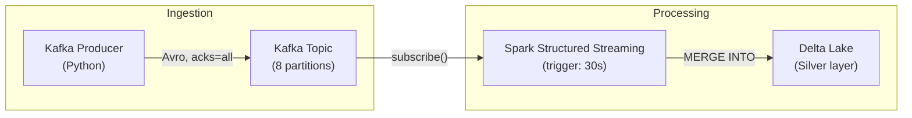
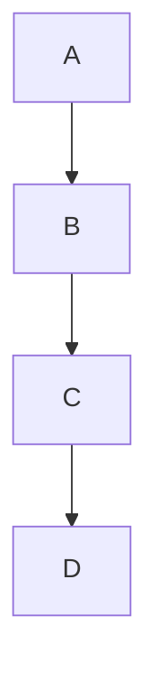
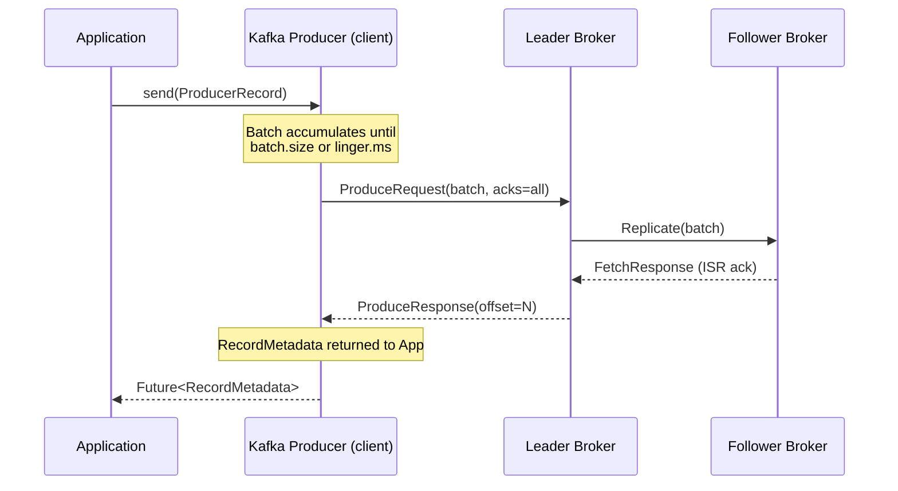
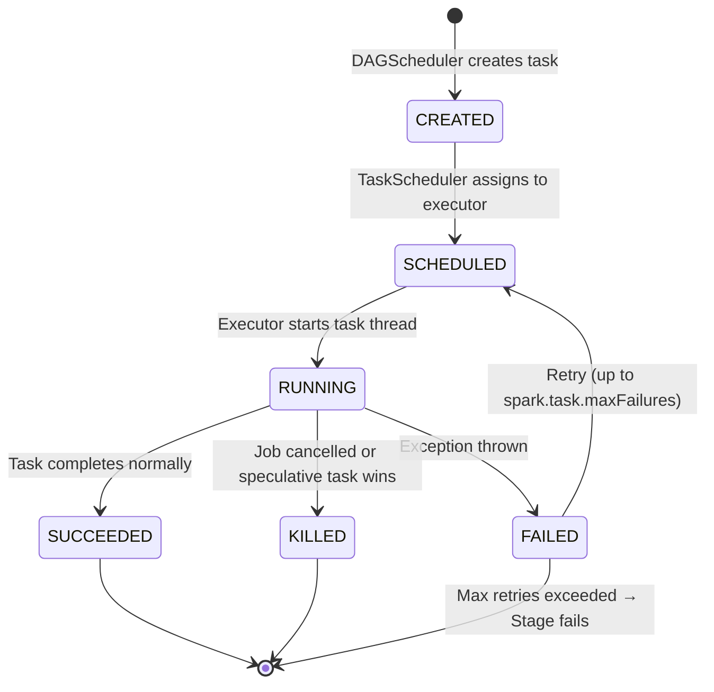

# Diagram Standards

This document defines when and how to generate diagrams in Data Engineering University. Every rule here is binding. The goal is that every diagram teaches, not decorates.

---

## Guiding Principle

A diagram is required when the concept cannot be fully explained by text alone — specifically, when spatial relationships, data flows, time sequences, or hierarchies are central to the understanding. A diagram that merely restates the text is noise. A diagram that reveals structure the text cannot show is essential.

When in doubt, ask: *"Does a reader understand this faster with the diagram, or would they understand it just as well without it?"* If the answer is "just as well without it," do not add the diagram.

---

## Diagram Type Decision Tree

```
Is the concept about...

├── Components and how they connect?
│   ├── Within one machine / process → ASCII whiteboard
│   └── Across machines / services → Mermaid graph TD/LR
│
├── Time-ordered interactions (A sends to B, B replies to A)?
│   └── Mermaid sequenceDiagram
│
├── States and transitions (lifecycle, FSM)?
│   └── Mermaid stateDiagram-v2
│
├── Class/type structure (inheritance, composition)?
│   └── Mermaid classDiagram
│
├── A module dependency or prerequisite graph?
│   └── Mermaid graph TD
│
├── A complex cloud architecture (VPCs, services, availability zones)?
│   └── PlantUML (C4 model) or draw.io exported PNG
│
└── An interview whiteboard answer?
    └── ASCII art (always)
```

---

## Mermaid: When and How

### graph TD / graph LR

Use for: data pipelines, component architectures, dependency graphs, data flow diagrams.

**Required:** Use `TD` (top-down) for hierarchies and dependency relationships. Use `LR` (left-right) for pipeline stages where data flows left to right.

**Required elements:**
- Subgraphs for logical groupings (e.g., `subgraph Ingestion Layer`).
- Quoted, multi-word labels for every node.
- Edge labels when the relationship is not obvious (e.g., `--"serialized as Arrow"-->`)

**Example — correct:**


**Example — banned:**

(No labels, no context, teaches nothing.)

---

### sequenceDiagram

Use for: producer-broker-consumer interactions, request-response cycles, distributed transaction protocols (2PC), consensus rounds (Raft leader election), authentication flows.

**Required elements:**
- `participant` declarations with full descriptive names.
- `Note over` annotations for important state changes.
- Activation bars (using `activate`/`deactivate`) when call depth matters.

**Example — Kafka producer flow:**


---

### stateDiagram-v2

Use for: Spark job states (WAITING → RUNNING → SUCCEEDED/FAILED), Kafka consumer group states (PreparingRebalance → CompletingRebalance → Stable), Airflow task states.

**Required elements:**
- `[*]` for initial and terminal states.
- Edge labels on every transition.
- Notes for conditions that trigger each transition.

**Example — Spark task lifecycle:**


---

### classDiagram

Use for: Spark's type hierarchy (RDD → DataFrame → Dataset), Kafka's consumer interfaces, Airflow's operator hierarchy.

**Required elements:**
- Relationship types: `<|--` for inheritance, `*--` for composition, `o--` for aggregation.
- Method signatures in classes where the method is referenced in the module text.

---

## PlantUML: When and How

Use PlantUML for C4 architecture diagrams when the system spans multiple machines, cloud services, and external actors.

### C4 Levels

| Level | Use when |
|---|---|
| Context (C1) | Showing the system's place in the business landscape |
| Container (C2) | Showing the major technical components (services, databases, queues) |
| Component (C3) | Showing internal structure of one container |
| Code (C4) | Showing class relationships (use Mermaid classDiagram instead) |

**Always include:**
- `Person()` for human actors.
- `System()` for the system being designed.
- `System_Ext()` for external systems.
- `Rel()` for every significant data flow, with a label.

**Example — Kafka Connect C2:**
```plantuml
@startuml
!include https://raw.githubusercontent.com/plantuml-stdlib/C4-PlantUML/master/C4_Container.puml

Person(eng, "Data Engineer", "Configures connectors")
System_Boundary(kc, "Kafka Connect Cluster") {
    Container(worker, "Connect Worker", "Java process", "Runs connector tasks")
    Container(api, "REST API", "HTTP", "Connector management")
}
System_Ext(src, "Source Database", "PostgreSQL")
System_Ext(kafka, "Kafka", "Message broker")
System_Ext(sink, "Data Warehouse", "BigQuery")

Rel(eng, api, "POST /connectors", "HTTP")
Rel(api, worker, "Deploy connector task")
Rel(worker, src, "JDBC polling / CDC", "JDBC/Debezium")
Rel(worker, kafka, "Produce records", "Kafka protocol")
Rel(worker, sink, "Sink records", "BigQuery API")
@enduml
```

---

## ASCII Whiteboard: When and How

ASCII whiteboard diagrams are mandatory in the "First Principles" and "Internal Architecture" sections of every module. They must be usable as an interview whiteboard answer — a reader should be able to reproduce the diagram by hand in a 45-minute interview.

### Character Set

Always use Unicode box-drawing characters:

```
Corners:       ┌ ┐ └ ┘
Horizontal:    ─
Vertical:      │
T-junctions:   ├ ┤ ┬ ┴
Cross:         ┼
Arrows:        → ← ↑ ↓ ► ◄ ▲ ▼
Double lines:  ═ ║ ╔ ╗ ╚ ╝ (for emphasis)
Dots/fills:    · ▪ █
```

### Width Limit

72 characters maximum. This ensures diagrams render correctly in all terminals, GitHub, and Obsidian.

### Required Labels

Every box must be labelled. Every arrow must be labelled if the relationship is not self-evident. Every layer must be labelled if the diagram has layers.

### Example — Memory Hierarchy (correct format):

```
┌──────────────────────────────────────────────────────────┐
│                   MEMORY HIERARCHY                       │
├─────────────────────┬────────────┬───────────────────────┤
│  Level              │  Latency   │  Size (typical)       │
├─────────────────────┼────────────┼───────────────────────┤
│  CPU Registers      │  ~0.3 ns   │  ~1 KB (64 × 64-bit) │
│  L1 Cache           │  ~1 ns     │  32–64 KB             │
│  L2 Cache           │  ~4 ns     │  256 KB – 1 MB        │
│  L3 Cache (LLC)     │  ~10 ns    │  8 – 64 MB            │
│  DRAM               │  ~60 ns    │  64 GB – 1 TB         │
│  NVMe SSD           │  ~100 µs   │  1 – 8 TB             │
│  SATA SSD           │  ~500 µs   │  1 – 8 TB             │
│  Network (same DC)  │  ~250 µs   │  ∞                    │
└─────────────────────┴────────────┴───────────────────────┘
```

---

## Post-Diagram Explanation Rule

**Every diagram must be followed immediately by an explanation.** The explanation must:

1. Name every labelled component in the diagram and state its role.
2. Trace the primary data flow or control flow shown in the diagram.
3. State what the diagram does NOT show (the most important omissions, so the reader does not over-generalize).

Minimum explanation length: one paragraph per logical group of components in the diagram.

---

## Diagram Quality Gates

A diagram passes quality review if and only if:

- [ ] All nodes/boxes are labelled with descriptive names.
- [ ] All edges/arrows are labelled where the relationship is not obvious.
- [ ] There is an explanation paragraph immediately after the diagram.
- [ ] The diagram fits within 72 characters (ASCII) or renders without horizontal scroll (Mermaid/PlantUML).
- [ ] The diagram is syntactically correct (Mermaid/PlantUML diagrams must compile without errors).
- [ ] The diagram does not merely restate what the text says — it reveals structure or flow.
- [ ] Every component shown in the diagram is mentioned in the explanation.
