# Module Dependency Graph

This graph shows which modules must be completed before starting each subsequent module. Follow arrows: `A --> B` means "complete A before B."

Nodes are labeled `SchoolID-MNN` (e.g., `00-M01` = CS Foundations, Module 1).

---

## Full Dependency Graph

```mermaid
graph TD
    %% ── CS Foundations ──────────────────────────────────────
    A1["00-M01\nHow Computers Execute Programs"]
    A2["00-M02\nMemory & Storage Hierarchy"]
    A3["00-M03\nConcurrency & Parallelism"]
    A4["00-M04\nNetworking Fundamentals"]
    A5["00-M05\nOS Internals"]

    A1 --> A2
    A1 --> A3
    A1 --> A4
    A1 --> A5

    %% ── Linux ───────────────────────────────────────────────
    B1["01-M01\nLinux Architecture"]
    B2["01-M02\nFile System & IO"]
    B3["01-M03\nProcesses & Signals"]
    B4["01-M04\nShell Scripting"]
    B5["01-M05\nPerformance Tools"]

    A1 --> B1
    A2 --> B2
    A3 --> B3
    B1 --> B2
    B1 --> B3
    B3 --> B4
    B2 --> B5
    B3 --> B5

    %% ── Networking ──────────────────────────────────────────
    C1["02-M01\nOSI & TCP/IP"]
    C2["02-M02\nDNS & HTTP"]
    C3["02-M03\nLoad Balancers & Proxies"]
    C4["02-M04\nNetwork Security"]

    A4 --> C1
    C1 --> C2
    C2 --> C3
    C1 --> C4

    %% ── Distributed Systems ─────────────────────────────────
    D1["03-M01\nCAP Theorem"]
    D2["03-M02\nConsensus & Raft"]
    D3["03-M03\nReplication & Partitioning"]
    D4["03-M04\nDistributed Transactions"]
    D5["03-M05\nObservability"]

    A4 --> D1
    D1 --> D2
    D1 --> D3
    D3 --> D4
    D2 --> D4
    B5 --> D5

    %% ── Databases ───────────────────────────────────────────
    E1["04-M01\nStorage Engines"]
    E2["04-M02\nIndexing"]
    E3["04-M03\nQuery Execution"]
    E4["04-M04\nACID & Isolation Levels"]
    E5["04-M05\nReplication & Sharding"]

    A2 --> E1
    B2 --> E1
    E1 --> E2
    E2 --> E3
    E1 --> E4
    D3 --> E5
    E4 --> E5

    %% ── SQL ─────────────────────────────────────────────────
    F1["06-M01\nSQL Execution Internals"]
    F2["06-M02\nWindow Functions"]
    F3["06-M03\nQuery Optimization"]
    F4["06-M04\nAdvanced Joins"]
    F5["06-M05\nRecursive CTEs"]

    E3 --> F1
    F1 --> F2
    F1 --> F3
    E2 --> F3
    F1 --> F4
    F4 --> F5

    %% ── Python ──────────────────────────────────────────────
    G1["07-M01\nPython Internals"]
    G2["07-M02\nConcurrency asyncio/threading"]
    G3["07-M03\nMemory Management"]
    G4["07-M04\nData Structures & Algorithms"]
    G5["07-M05\nPython for Data Engineering"]

    A3 --> G1
    G1 --> G2
    A2 --> G3
    G1 --> G3
    A1 --> G4
    G1 --> G5
    G3 --> G5

    %% ── Apache Spark ─────────────────────────────────────────
    H1["08-M01\nSpark Architecture"]
    H2["08-M02\nRDD vs DataFrame vs Dataset"]
    H3["08-M03\nSpark Execution Engine"]
    H4["08-M04\nShuffle & Partitioning"]
    H5["08-M05\nSpark Optimization"]

    G1 --> H1
    D3 --> H1
    H1 --> H2
    H2 --> H3
    H3 --> H4
    E2 --> H5
    H4 --> H5

    %% ── PySpark ──────────────────────────────────────────────
    I1["09-M01\nPySpark API"]
    I2["09-M02\nPySpark UDFs"]
    I3["09-M03\nStructured Streaming"]
    I4["09-M04\nDelta Lake with PySpark"]

    H1 --> I1
    G5 --> I1
    I1 --> I2
    H3 --> I3
    I1 --> I3
    I3 --> I4

    %% ── Streaming ────────────────────────────────────────────
    J1["10-M01\nStream Processing Fundamentals"]
    J2["10-M02\nWindowing & Watermarks"]
    J3["10-M03\nExactly-Once Semantics"]
    J4["10-M04\nFlink vs Spark Streaming"]

    D1 --> J1
    I3 --> J1
    J1 --> J2
    J2 --> J3
    D4 --> J3
    J3 --> J4

    %% ── Kafka ────────────────────────────────────────────────
    K1["11-M01\nKafka Architecture"]
    K2["11-M02\nProducers & Consumers"]
    K3["11-M03\nKafka Streams"]
    K4["11-M04\nKafka Connect"]
    K5["11-M05\nSchema Registry"]

    D3 --> K1
    C1 --> K1
    K1 --> K2
    K2 --> K3
    J1 --> K3
    K2 --> K4
    K3 --> K5

    %% ── BigQuery ─────────────────────────────────────────────
    L1["12-M01\nBigQuery Architecture"]
    L2["12-M02\nStorage & Columnar Format"]
    L3["12-M03\nQuery Optimization BQ"]
    L4["12-M04\nCost Management"]
    L5["12-M05\nBigQuery ML"]

    E1 --> L1
    F3 --> L1
    L1 --> L2
    L2 --> L3
    F3 --> L3
    L3 --> L4
    L3 --> L5

    %% ── Airflow ──────────────────────────────────────────────
    M1["13-M01\nAirflow Architecture"]
    M2["13-M02\nDAGs & Operators"]
    M3["13-M03\nTask Dependencies"]
    M4["13-M04\nCustom Operators"]
    M5["13-M05\nAirflow in Production"]

    G5 --> M1
    M1 --> M2
    M2 --> M3
    M3 --> M4
    M4 --> M5
    D5 --> M5

    %% ── dbt ──────────────────────────────────────────────────
    N1["14-M01\ndbt Architecture"]
    N2["14-M02\nModels & Materializations"]
    N3["14-M03\nTesting & Documentation"]
    N4["14-M04\nAdvanced dbt Patterns"]

    F1 --> N1
    N1 --> N2
    N2 --> N3
    N3 --> N4

    %% ── Open Table Formats ───────────────────────────────────
    O1["15-M01\nTable Format Comparison"]
    O2["15-M02\nApache Iceberg"]
    O3["15-M03\nDelta Lake"]
    O4["15-M04\nApache Hudi"]

    E1 --> O1
    I4 --> O1
    O1 --> O2
    O1 --> O3
    O1 --> O4

    %% ── Data Modeling ────────────────────────────────────────
    P1["16-M01\nDimensional Modeling"]
    P2["16-M02\nData Vault"]
    P3["16-M03\nOne Big Table"]
    P4["16-M04\nSchema Evolution"]

    F2 --> P1
    P1 --> P2
    P1 --> P3
    K5 --> P4
    O2 --> P4

    %% ── System Design ────────────────────────────────────────
    Q1["17-M01\nDesign a Data Pipeline"]
    Q2["17-M02\nDesign a Streaming Platform"]
    Q3["17-M03\nDesign a Data Warehouse"]
    Q4["17-M04\nDesign a Lakehouse"]

    M5 --> Q1
    N4 --> Q1
    K3 --> Q2
    J4 --> Q2
    L3 --> Q3
    P1 --> Q3
    O2 --> Q4
    Q3 --> Q4

    %% ── Production Engineering ───────────────────────────────
    R1["18-M01\nMonitoring & Alerting"]
    R2["18-M02\nCI/CD for Data"]
    R3["18-M03\nData Quality Frameworks"]
    R4["18-M04\nIncident Response"]

    D5 --> R1
    N3 --> R2
    N3 --> R3
    R1 --> R4

    %% ── Interview Preparation ────────────────────────────────
    S1["19-M01\nCoding Interview"]
    S2["19-M02\nSystem Design Interview"]
    S3["19-M03\nBehavioral Interview"]

    F5 --> S1
    G4 --> S1
    Q4 --> S2
    Q3 --> S2
    S1 --> S3
    S2 --> S3
```



---

## Tier View (Leveled Prerequisite Groups)

Reading this table left-to-right: complete all modules in Tier N before starting Tier N+1 modules that depend on them.

| Tier | Modules | Notes |
|------|---------|-------|
| **0 — Start Here** | 00-M01 | Zero prerequisites. The root of the entire graph. |
| **1 — Early Foundations** | 00-M02, 00-M03, 00-M04, 00-M05, 06-M01 (SQL can start here) | Direct children of 00-M01 |
| **2 — OS & Language Layer** | 01 Linux (all), 02-M01 Networking, 07-M01 Python Internals | Requires Tier 1 |
| **3 — Storage & Query** | 04 Databases M01–M03, 06 SQL M01–M03, 07 Python M02–M04 | Requires Tier 2 |
| **4 — Platform Tools** | 08 Spark, 11 Kafka M01–M02, 13 Airflow M01–M03, 14 dbt M01–M02 | Requires Tier 3 |
| **5 — Advanced Distributed** | 09 PySpark, 10 Streaming, 11 Kafka M03–M05, 15 Table Formats | Requires Tier 4 |
| **6 — Specialisation** | 12 BigQuery, 13 Airflow M04–M05, 14 dbt M03–M04, 16 Data Modeling | Requires Tier 5 |
| **7 — Architecture** | 17 System Design, 18 Production Engineering | Requires Tier 6 |
| **8 — Interview / Leadership** | 19 Interview Preparation | Requires all prior tiers |

---

## Critical Path (shortest route to staff-level competence)

```
00-M01 → 00-M02 → 00-M03 → 07-M01 → 07-M03 →
04-M01 → 04-M04 → 08-M01 → 08-M03 → 08-M04 →
09-M03 → 10-M01 → 10-M03 → 11-M01 → 11-M02 →
15-M01 → 15-M02 → 17-M04 → 18-M01 → 19-M02
```

This 20-module critical path touches every major concept required for a staff data engineering interview, in dependency order.
