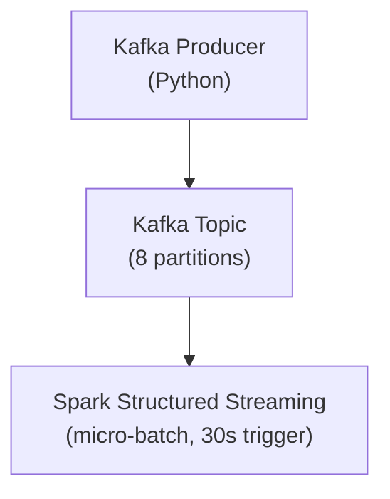
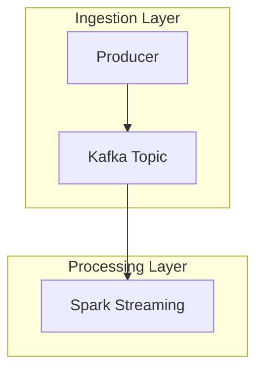
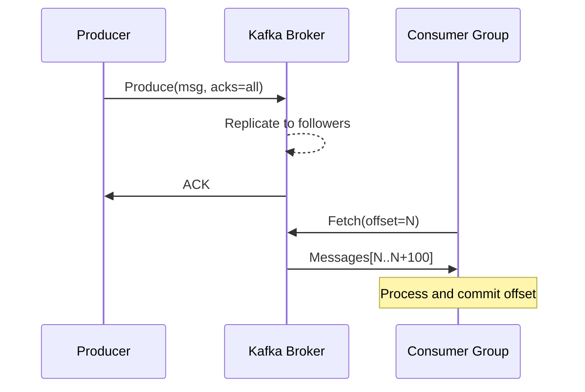

# Repository Standards

This document is the law of the repository. Every module, diagram, code block, and citation must conform to these standards. When in doubt, check here first.

---

## 1. Folder Conventions

### Top-Level Structure

```
Data-Engg-University/
├── *.md                  ← University-level documents (uppercase, underscore-separated)
├── assets/               ← Shared non-module resources
│   ├── diagrams/         ← Exported PNG/SVG from Mermaid and PlantUML
│   ├── flashcards/       ← Anki-compatible TSV decks, one per school
│   └── cheat_sheets/     ← Master cheat sheets, one per school
└── NN_School_Name/       ← School folders (two-digit prefix, PascalCase name)
    └── MNN_Module_Name/  ← Module folders (M + two-digit number, PascalCase name)
        └── README.md     ← The module (always README.md, never anything else)
```

### School Naming

School folders use a two-digit zero-padded prefix followed by an underscore and a PascalCase name with underscores separating words:

```
00_CS_Foundations
01_Linux
08_Apache_Spark
15_Iceberg_Delta_Hudi
```

Never: `CSFoundations/`, `cs_foundations/`, `School00/`.

### Module Naming

Module folders use `M` followed by a two-digit zero-padded number, an underscore, and a PascalCase descriptive name:

```
M01_How_Computers_Execute_Programs
M02_Memory_and_Storage_Hierarchy
M05_Spark_Optimization
```

Never: `module_1/`, `01_spark/`, `HowComputersWork/`.

### Module Entry Point

Every module has exactly one file: `README.md`. No subfolders inside module directories unless the module has companion lab files. If lab files exist, place them in a `lab/` subdirectory:

```
M01_How_Computers_Execute_Programs/
├── README.md
└── lab/
    ├── lab1_cache_line.py
    ├── lab2_row_vs_columnar.py
    └── lab3_python_vs_numpy.py
```

---

## 2. File Naming Conventions

| Type | Convention | Example |
|---|---|---|
| University-level docs | `UPPERCASE_UNDERSCORE.md` | `CURRICULUM.md`, `SEMESTER_DESIGN.md` |
| Module entry point | Always `README.md` | — |
| Lab scripts | `labN_description.py` | `lab1_cache_line.py` |
| Flashcard decks | `NN_school_name.tsv` | `00_cs_foundations.tsv` |
| Cheat sheets | `NN_school_name.md` | `08_apache_spark.md` |
| Diagram exports | `NN_MNN_description.png` | `00_M01_cpu_pipeline.png` |

Rules:
- **No spaces** in any filename. Ever.
- **Lowercase** for all non-university-level files and lab scripts.
- **Underscores**, not hyphens, as word separators.
- **Descriptive names** — a file named `diagram1.png` is banned.

---

## 3. Markdown Conventions

### Document Structure

Every module `README.md` follows the exact 21-section template defined in `MODULE_GENERATION_STRATEGY.md`. No sections may be omitted. No sections may be reordered.

Every university-level document (`CURRICULUM.md`, `SEMESTER_DESIGN.md`, etc.) begins with:

```markdown
# Document Title

> One-line description of what this document is.

---
```

### Headings

- `#` H1: document title only (one per file).
- `##` H2: top-level sections.
- `###` H3: subsections within a section.
- `####` H4: sub-subsections (use sparingly).
- Never skip heading levels (no jumping from H2 to H4).

### Lists

Use bullet lists (`-`) for unordered items. Use numbered lists (`1.`) for sequences or steps where order matters. Never mix the two in the same list.

Minimum list-item length: one complete sentence. Never use single-word bullets.

### Tables

All tables use GitHub-Flavored Markdown (GFM) pipe syntax with aligned columns:

```markdown
| Column A | Column B | Column C |
|---|---|---|
| Value 1  | Value 2  | Value 3  |
```

Every table must have a header row. Every column must have a separator row. Never put a table inside a blockquote.

### Code Blocks

All code blocks must specify the language:

````markdown
```python
# Python code here
```

```sql
-- SQL here
```

```bash
# Shell commands here
```


````

**Banned:** triple backticks with no language specifier. Even for plain text output, use `text` or `console`.

### Emphasis

- **Bold** (`**text**`): for key terms being defined for the first time, and for critical warnings.
- *Italic* (`*text*`): for emphasis within a sentence, for titles of books, and for introducing foreign technical terms.
- `Code` (`` `code` ``): for any technical name that is also a symbol in a programming language: function names, variables, class names, file paths, commands, register names (`rax`, `rip`), flags (`acks`, `linger.ms`).
- Never use bold for decoration. If everything is bold, nothing is.

### Blockquotes

Use blockquotes (`>`) for: key insights that deserve to stand alone, quotes from papers or books (with attribution), and "core insight" callouts at the end of a section.

```markdown
> The gap between "data in CPU register" and "data in RAM" is 200×. Every performance
> optimization is an effort to move data closer to the CPU before it is needed.
```

### Horizontal Rules

Use `---` (three dashes) to separate major sections at the H2 level when the visual break adds clarity. Do not use `***` or `___`.

### Internal Cross-Links

Link to other modules using relative Markdown paths:

```markdown
[M02: Memory and Storage Hierarchy](../M02_Memory_and_Storage_Hierarchy/README.md)
[Back to Curriculum](../../CURRICULUM.md)
```

Every module's final line must contain a "Next module" link and a "Back to School index" link.

---

## 4. Diagram Conventions

### When to Use Each Diagram Type

| Situation | Diagram Type |
|---|---|
| Data flow between components | Mermaid `graph TD` or `graph LR` |
| Time-ordered interactions between components | Mermaid `sequenceDiagram` |
| System architecture (cloud/cluster topology) | Mermaid `architecture-beta` or PlantUML |
| State machines / lifecycle diagrams | Mermaid `stateDiagram-v2` |
| Class/type hierarchies | Mermaid `classDiagram` |
| Interview whiteboard sketches | ASCII art (inline in the text) |
| Complex multi-component cloud architectures | Draw.io exported as PNG, stored in `assets/diagrams/` |

### Rules

1. Every diagram must be followed immediately by an explanation paragraph. A diagram with no explanation is banned.
2. Every complex diagram must have labelled nodes — never unnamed boxes.
3. Mermaid diagrams are always placed in fenced code blocks with the `mermaid` language tag.
4. PlantUML diagrams are always placed in fenced code blocks with the `plantuml` language tag.
5. ASCII diagrams use consistent box-drawing characters: `┌ ─ ┐ │ └ ┘ ├ ┤ ┬ ┴ ┼` (Unicode box drawing).

---

## 5. Mermaid Standards

### Graph Direction

- Use `TD` (top-down) for hierarchies, dependency graphs, and data flow from producer to consumer.
- Use `LR` (left-right) for pipelines and execution sequences.
- Use `TB` (top-bottom) — alias for TD — never `BT` or `RL` unless specifically required.

### Node Labels

Node labels must be human-readable. No single-letter labels for complex diagrams. For multi-line labels, use `\n` inside the label string.



### Subgraphs

Use subgraphs to group related nodes. Label every subgraph.



### Sequence Diagrams

Participant names must be descriptive, not single letters. Use `Note over` for important annotations.



---

## 6. PlantUML Standards

Use PlantUML for:
- C4 architecture diagrams (system context, container, component).
- Detailed class hierarchies in the databases and distributed systems modules.
- Deployment diagrams showing network topology.

```plantuml
@startuml
!include https://raw.githubusercontent.com/plantuml-stdlib/C4-PlantUML/master/C4_Context.puml

Person(engineer, "Data Engineer", "Builds and maintains pipelines")
System(spark, "Apache Spark", "Distributed compute engine")
System_Ext(s3, "Amazon S3", "Object storage")

Rel(engineer, spark, "Submits jobs")
Rel(spark, s3, "Reads/writes data")
@enduml
```

PlantUML diagrams must always have `@startuml` and `@enduml` delimiters and must compile without errors.

---

## 7. ASCII Whiteboard Standards

Every module's "internal architecture" section must include at least one ASCII whiteboard diagram. These simulate a technical interview answer drawn on a whiteboard. They must:

- Use Unicode box-drawing characters (not dashes and pipes).
- Be self-contained (no external dependencies to render).
- Fit within 72 characters of width to render correctly on all screens.
- Be followed by an explanation of each labelled component.

Standard box-drawing set for ASCII diagrams:
```
┌──────────┐  ┌──────────┐
│ Component│  │ Component│
│   Name   ├─►│   Name   │
└──────────┘  └──────────┘
                  │
                  ▼
             ┌──────────┐
             │  Output  │
             └──────────┘
```

---

## 8. Code Block Conventions

### Language Tags

| Content | Tag |
|---|---|
| Python | `python` |
| PySpark | `python` (with a comment `# PySpark`) |
| SQL (generic) | `sql` |
| BigQuery SQL | `sql` (with `-- BigQuery` comment) |
| Bash / Shell | `bash` |
| Terminal output | `console` |
| YAML | `yaml` |
| JSON | `json` |
| Java | `java` |
| Scala | `scala` |
| Mermaid | `mermaid` |
| PlantUML | `plantuml` |
| x86 Assembly | `asm` |

### Code Quality Standards

Every code block in a module must:
1. Be runnable as-is (or clearly labelled as pseudocode with `# PSEUDOCODE` comment).
2. Include imports for any non-standard library used.
3. Include a comment explaining what the code demonstrates.
4. Include expected output as a `console` block below the code, where the output is deterministic.
5. Not use deprecated APIs. If a deprecated API is shown for historical context, label it `# DEPRECATED — shown for context only`.

### No Magic Numbers

Every constant in a code example must have a comment explaining its value:

```python
BATCH_SIZE = 10_000   # Process 10K rows per executor per task
TIMEOUT_S  = 30       # 30-second timeout matches Kafka broker session.timeout.ms
```

---

## 9. Citation Conventions

### In-Text Citations

When stating a non-obvious technical fact, cite the source inline:

```markdown
The Raft consensus algorithm guarantees that at most one leader exists per term
(Ongaro & Ousterhout, 2014, §5.2 — *In Search of an Understandable Consensus Algorithm*).
```

### References Section

Every module ends with a `## References` section. Format:

```markdown
## References

- **Author(s)** — *Title* (Edition if applicable). Publisher, Year. URL if online.
- **Author(s)** — *Paper Title*. Venue, Year. URL.
```

### Accepted Source Types

In descending order of authority:
1. Primary sources: official documentation, research papers, RFCs, source code.
2. Respected textbooks: listed in the bibliography below.
3. Conference talks from major venues: VLDB, SIGMOD, Strange Loop, Spark Summit, Kafka Summit.
4. Official engineering blogs: Databricks, Confluent, Google, Netflix, Airbnb.

**Banned sources:** Medium posts without attribution, anonymous blogs, Wikipedia as a primary source (may be used for introductory context only), outdated documentation for versions more than 2 major versions old.

### Canonical Bibliography

These books are authoritative references for the entire university:

| Abbreviation | Full Title |
|---|---|
| P&H | Patterson & Hennessy — *Computer Organization and Design* (5th ed.) |
| B&O | Bryant & O'Hallaron — *Computer Systems: A Programmer's Perspective* (3rd ed.) |
| DDIA | Kleppmann — *Designing Data-Intensive Applications* (1st ed.) |
| FNP | Flink — Narkhede, Shapira, Palino — *Kafka: The Definitive Guide* (2nd ed.) |
| TAOCP | Knuth — *The Art of Computer Programming* (Vol. 1–4) |
| SYSPERF | Gregg — *Systems Performance* (2nd ed.) |
| DWH | Kimball & Ross — *The Data Warehouse Toolkit* (3rd ed.) |

---

## 10. Cross-Linking Conventions

### Within a Module

When a section refers to a concept covered earlier in the same module, reference the section heading:

```markdown
(see [§5.3 Registers in Detail](#53-registers-in-detail) above)
```

### Across Modules

Use relative paths from the current module's location:

```markdown
(covered in [00-M02: Memory Hierarchy](../M02_Memory_and_Storage_Hierarchy/README.md))
```

### Prerequisite Callouts

Every module's `## 2. Prerequisites` section must list explicit cross-links to the modules that must be completed first:

```markdown
## 2. Prerequisites

- [00-M01: How Computers Execute Programs](../M01_How_Computers_Execute_Programs/README.md) — required for understanding pipeline stalls and cache behavior.
- [00-M02: Memory and Storage Hierarchy](../M02_Memory_and_Storage_Hierarchy/README.md) — required for storage engine internals.
```

### "Next Module" Footer

Every module ends with:

```markdown
*Next module → [MNN: Title](../MNN_Title/README.md)*  
*Back to [School NN index](../../CURRICULUM.md#school-nn--school-name)*
```

---

## 11. Terminology Consistency

The following terms have defined meanings in this university. Use them consistently and exactly:

| Term | Meaning | Never say |
|---|---|---|
| `executor` | A JVM process in Spark that runs tasks | "worker" (ambiguous), "node" (could mean machine) |
| `partition` | A logical chunk of a dataset or Kafka topic | "shard" (use only for database sharding) |
| `task` | A single unit of work in Spark, run on one partition by one executor | "job", "step" |
| `stage` | A group of tasks separated from others by a shuffle boundary | "phase" |
| `shuffle` | The redistribution of data across partitions, requiring network I/O | "repartition" (repartition is a Spark API call that causes a shuffle) |
| `broker` | A Kafka server node | "server", "node" (use broker when talking about Kafka) |
| `consumer group` | A set of Kafka consumers sharing topic offsets | "consumer cluster" |
| `event time` | The timestamp when an event occurred in the real world | "actual time", "real time" |
| `processing time` | The timestamp when an event was processed by the system | "ingestion time" (only if specifically referring to ingestion) |
| `idempotent` | An operation that produces the same result if applied multiple times | "safe", "repeatable" |
| `cardinality` | The number of distinct values in a column | "uniqueness" |
| `predicate pushdown` | Moving filter conditions earlier in the query plan to reduce data read | "filter pushdown" |
