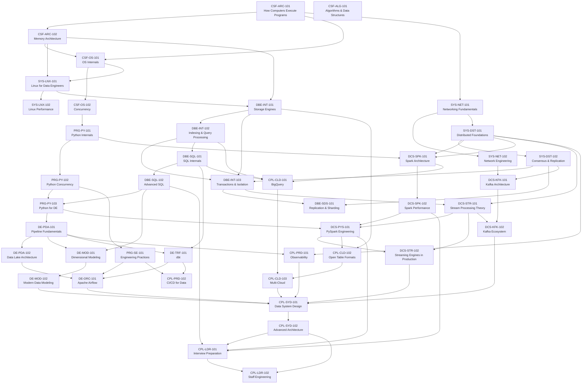

# Module Dependency Graph

This document shows the dependency chain between courses and explains *why* each dependency exists. Understanding the reason for a dependency is as important as knowing the dependency itself.

---

## The Master Dependency Chain

This is the primary critical path from zero to Staff Engineer:

```
CPU Architecture (CSF-ARC-101)
  ↓ [the CPU is the execution engine for all code]
Memory Architecture (CSF-ARC-102)
  ↓ [memory behavior determines I/O patterns and caching]
OS Internals (CSF-OS-101)
  ↓ [the OS manages all hardware resources]
Concurrency (CSF-OS-102)
  ↓ [concurrency is an OS-level capability]
Linux for Data Engineers (SYS-LNX-101)
  ↓ [Linux is the OS that runs all data systems]
Linux Performance Tools (SYS-LNX-102)
  ↓ [tools build on the knowledge of what to measure]
Python Internals (PRG-PY-101)
  ↓ [Python runs on top of the OS — internals require OS + CPU knowledge]
Python Concurrency (PRG-PY-102)
  ↓ [async/threading build on OS concurrency model]
Networking Fundamentals (SYS-NET-101)
  ↓ [distributed systems are networked systems]
Distributed Systems Foundations (SYS-DST-101)
  ↓ [consensus requires understanding of network failure models]
Consensus and Replication (SYS-DST-102)
  ↓ [storage engines implement ACID — requires transaction theory]
Storage Engines (DBE-INT-101)
  ↓ [indexes are built on storage engine primitives]
Indexing and Query Processing (DBE-INT-102)
  ↓ [transactions require storage engine + isolation understanding]
Transactions and Isolation (DBE-INT-103)
  ↓ [SQL execution uses query processing internals]
SQL Internals (DBE-SQL-101)
  ↓ [advanced SQL builds on internals]
Advanced SQL (DBE-SQL-102)
  ↓ [Python data tools are the API layer over storage]
Python for Data Engineering (PRG-PY-103)
  ↓ [pipelines are the first applied use of all the above]
Data Pipeline Fundamentals (DE-PDA-101)
  ↓ [data modeling determines how pipelines structure output]
Dimensional Modeling (DE-MOD-101)
  ↓ [dbt implements the transformation + modeling layer]
dbt (DE-TRF-101)
  ↓ [Airflow orchestrates dbt and all other pipeline steps]
Apache Airflow (DE-ORC-101)
  ↓ [Spark is the distributed compute engine for large-scale pipelines]
Spark Architecture (DCS-SPK-101)
  ↓ [Spark performance requires architecture mastery]
Spark Performance (DCS-SPK-102)
  ↓ [PySpark is the Python API to Spark]
PySpark Engineering (DCS-PYS-101)
  ↓ [streaming theory precedes streaming engines]
Stream Processing Theory (DCS-STR-101)
  ↓ [Kafka is the source/sink for streaming systems]
Kafka Architecture (DCS-KFK-101)
  ↓ [Kafka ecosystem: Connect, Streams, Schema Registry]
Kafka Ecosystem (DCS-KFK-102)
  ↓ [streaming engines in production]
Streaming Engines in Production (DCS-STR-102)
  ↓ [BigQuery is the cloud serving layer for the processed data]
Google BigQuery (CPL-CLD-101)
  ↓ [open table formats bridge distributed compute and cloud warehouses]
Open Table Formats (CPL-CLD-102)
  ↓ [observability makes the entire stack visible in production]
Data Systems Observability (CPL-PRD-101)
  ↓ [system design synthesizes everything into architecture]
Data System Design (CPL-SYD-101)
  ↓ [advanced architecture patterns layer on top of core system design]
Advanced Architecture Patterns (CPL-SYD-102)
```

---

## Why Each Dependency Exists

### CSF-ARC-101 → CSF-ARC-102 (CPU → Memory)
The CPU executes instructions that read and write memory. Understanding memory access latency (why a RAM access stalls the pipeline for 200 cycles) requires first understanding what the pipeline is and why it stalls. Without this, the cache line concept is memorization, not reasoning.

### CSF-ARC-102 → CSF-OS-101 (Memory → OS)
The OS is the software that manages physical memory (via the MMU and page tables) and CPU time (via the scheduler). Understanding virtual memory and the scheduler requires knowing what physical memory and CPU cycles actually are. Specifically: page faults, the page cache, and context switching cost are only meaningful if you understand cache lines and pipeline stalls from CSF-ARC-102.

### CSF-OS-101 → CSF-OS-102 (OS → Concurrency)
Concurrency (threads, mutexes, the GIL) is implemented by the OS kernel. A thread is a kernel-managed execution context. A mutex is a kernel synchronization primitive. Understanding concurrency correctly requires understanding what the scheduler does, what context switching costs, and how memory is shared between threads — all from CSF-OS-101.

### CSF-OS-101 → SYS-LNX-101 (OS → Linux)
Linux is a specific implementation of the UNIX operating system model. SYS-LNX-101 teaches the Linux-specific interfaces (inode, ext4, VFS, systemd) that implement the abstract OS concepts from CSF-OS-101. Without understanding OS internals, Linux administration is GUI-level memorization.

### CSF-OS-102 → PRG-PY-101 (Concurrency → Python Internals)
CPython's GIL is a concurrency primitive implemented on top of OS threads. Understanding why the GIL exists (as a simplified mutex protecting the interpreter's object model), when it's released (during C-extension calls and I/O), and how to work around it (multiprocessing, native extensions) requires the concurrency mental model from CSF-OS-102.

### SYS-NET-101 → SYS-DST-101 (Networking → Distributed Systems)
Distributed systems are defined by the possibility of network partitions. The CAP theorem is a statement about what happens when a network splits. Failure detectors use heartbeat timeouts over TCP. Understanding *why* these problems exist (and why they can't be solved in general) requires understanding what TCP provides (reliable delivery but with latency and possible failure) and what it doesn't (guaranteed delivery with bounded latency). Without SYS-NET-101, distributed systems theory is abstract hand-waving.

### SYS-DST-101 → SYS-DST-102 (Foundations → Consensus)
Consensus algorithms (Raft, Paxos) are solutions to the distributed agreement problem. The problem statement itself requires the vocabulary of CSF-DST-101: network partitions, message ordering, process failures, and the impossibility results (FLP, CAP). Without this context, Raft is just a protocol description with no explanation of *why* it makes the choices it does.

### CSF-ARC-102 + SYS-LNX-101 → DBE-INT-101 (Memory + Linux → Storage Engines)
Storage engines are implemented on top of the Linux I/O subsystem. The B-tree's page size (4 KB) is chosen to match a Linux memory page. The LSM-tree's compaction is an I/O-intensive background process that interacts with the page cache. Write amplification is a disk I/O metric. Without understanding the page cache, fsync, and O_DIRECT (SYS-LNX-101), storage engine internals are floating architecture diagrams. Without understanding memory hierarchy (CSF-ARC-102), buffer pool management is opaque.

### SYS-DST-102 → DBE-INT-103 (Replication → Transactions)
ACID transactions in distributed databases (especially isolation levels across distributed replicas) require the vocabulary of distributed transactions: linearizability, sequential consistency, and the 2PC protocol. The MVCC (Multi-Version Concurrency Control) mechanism that provides snapshot isolation is deeply related to the version-based consistency models in SYS-DST-101. Without understanding distributed consistency, isolation levels above Read Committed are abstract labels.

### DBE-INT-102 → DBE-SQL-101 (Query Processing → SQL Internals)
The SQL query execution pipeline (parser → binder → logical planner → physical planner → executor) is an implementation of the query processing theory from DBE-INT-102. Reading an EXPLAIN plan is only meaningful if you know what hash joins, nested-loop joins, and index scans are and when the optimizer chooses each. Without DBE-INT-102, EXPLAIN output is uninterpretable noise.

### DBE-INT-101 → DCS-SPK-101 (Storage Engines → Spark)
Spark's memory management (on-heap vs off-heap, Project Tungsten), its spill-to-disk behavior (when executor memory is exceeded), and Delta Lake's storage layer (ACID on object storage using a transaction log) are all applications of storage engine concepts. Understanding why Spark spills to disk, what the spill cost is (write amplification), and how Delta Lake achieves atomicity requires the storage engine foundation.

### SYS-DST-101 → DCS-SPK-101 (Distributed Theory → Spark)
Spark is a distributed system. The Spark driver uses a coordinator-worker architecture. Spark tasks are distributed computations that can fail (node crashes, OOM) and are retried. Understanding why Spark makes the choices it does (no distributed transactions, optimistic execution, lineage-based recovery) requires the distributed systems vocabulary from SYS-DST-101.

### DCS-SPK-101 → DCS-KFK-101 (Spark → Kafka, parallel, not serial)
Kafka and Spark are often used together (Spark consuming from Kafka), but Kafka is not a prerequisite for Spark. However, both require SYS-DST-101 as a foundation. They are taught in the same semester because understanding both together enables the full streaming architecture pattern.

### DCS-STR-101 → DCS-PYS-101 (Streaming Theory → PySpark Streaming)
Structured Streaming is an implementation of the streaming model described in DCS-STR-101 (The Dataflow Model). Watermarks in Structured Streaming are an implementation of the abstract watermark concept from DCS-STR-101. Without the theory, students configure watermarks by cargo-culting examples without understanding why a watermark exists or what it costs.

### DBE-INT-101 → CPL-CLD-102 (Storage Engines → Open Table Formats)
Iceberg's manifest list + manifest file + data file hierarchy is a log-structured design, analogous to an LSM-tree's SSTable hierarchy. Delta Lake's transaction log is a write-ahead log (WAL), the same fundamental mechanism as Postgres's WAL. Without DBE-INT-101, the architectural choices in open table formats appear arbitrary. With it, they are immediately recognizable as applications of known storage engine patterns.

---

## Dependency Graph — Mermaid



---

## Dependency Tiers

Reading this table left-to-right: a course in tier N may only begin after all its tier (N-1) dependencies are met.

| Tier | Courses | Theme |
|---|---|---|
| 0 | CSF-ARC-101 | Absolute start — no prerequisites |
| 1 | CSF-ARC-102, CSF-OS-101 | Memory and OS (depend on CPU) |
| 2 | CSF-OS-102, SYS-LNX-101, SYS-NET-101, PRG-PY-101, CSF-ALG-101 | Concurrency, Linux, Networking, Python |
| 3 | SYS-LNX-102, SYS-NET-102, SYS-DST-101, PRG-PY-102, DBE-INT-101 | Performance tools, network engineering, distributed theory, storage |
| 4 | SYS-DST-102, DBE-INT-102, DBE-INT-103, PRG-PY-103, PRG-SE-101 | Consensus, indexing, transactions, Python data tools |
| 5 | DBE-SQL-101, DBE-SDS-101, DE-PDA-101 | SQL internals, sharding, pipeline fundamentals |
| 6 | DBE-SQL-102, DE-PDA-102, DE-MOD-101, DCS-SPK-101 | Advanced SQL, lake architecture, modeling, Spark |
| 7 | DE-TRF-101, DE-MOD-102, DCS-SPK-102, DCS-STR-101, DCS-KFK-101 | dbt, modern modeling, Spark tuning, streaming, Kafka |
| 8 | DE-ORC-101, DCS-PYS-101, DCS-KFK-102 | Airflow, PySpark, Kafka ecosystem |
| 9 | CPL-CLD-101, CPL-CLD-102, CPL-PRD-101, CPL-PRD-102, DCS-STR-102 | BigQuery, table formats, observability, CI/CD, streaming production |
| 10 | CPL-CLD-103, CPL-SYD-101 | Multi-cloud, system design |
| 11 | CPL-SYD-102, CPL-LDR-101 | Advanced architecture, interviews |
| 12 | CPL-LDR-102 | Staff/principal engineering leadership |
